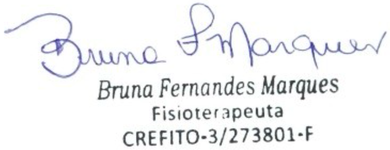

<br><br><br><br>

<div style="font-size:0.75em; line-height:1.4;">

# Parecer de Fisioterapia

<br>

**Ribeirão Preto, {{DIA}} de {{MES_EXTENSO}} de {{ANO}}.**

<br>

O presente documento refere-se ao parecer fisioterapêutico do paciente **Tarso Rollemberg Cipriano**, 6 anos, cujo responsável é **José Carlos Garcia Cipriano**. Foi diagnosticado com CID 10: M62, F84.0, transtornos musculares, alteração de tônus muscular e frouxidão ligamentar, com indicação fisioterapêutica 4x por semana.

Tarso apresenta alterações de tônus muscular global, hipermobilidade principalmente em membros inferiores durante atividades de agilidade e impacto (corridas e pulos), fraqueza de CORE, instabilidade em apoios unipodais e dificuldade em realizar atividades com contração isométrica. Contudo, para sequência no processo de intervenção, certifico a necessidade de seguimento, no atendimento de fisioterapia para o paciente Tarso, por tempo indeterminado.

As sessões acontecem na clínica **Affettività**, sediada na Rua Otto Benz, 864, CEP 14096-580, bairro Nova Ribeirânia, na cidade de Ribeirão Preto, SP.

## Registro de Sessões Realizadas no Período

<br>

{{LISTA_SESSOES}}

<!--
Formato esperado para {{LISTA_SESSOES}}:

DD/MM/AAAA - R$42,50 - Atendimento Fisioterapêutico
DD/MM/AAAA - R$42,50 - Atendimento Fisioterapêutico
...

Quantidade esperada: entre 16 e 20 sessões
-->

<br>

<div align="center">
  
</div>

<div align="center" style="font-size:0.75em; line-height:1.3;">
<strong>Bruna Fernandes Marques</strong><br>
Fisioterapeuta<br>
Crefito 3/273801-F
</div>

</div>

<br>

---

## ⚙️ METADADOS PARA AUTOMAÇÃO

```yaml
placeholders:
  MES_EXTENSO: "Fevereiro"
  DIA: "02"
  ANO: "2026"

  NOME_PACIENTE: "Tarso Rollemberg Cipriano"
  NOME_RESPONSAVEL: "José Carlos Garcia Cipriano"

  CID: "M62 / F84.0"

  VALOR_SESSAO: "42,50"
  TIPO_ATENDIMENTO: "Atendimento Fisioterapêutico"
  FREQUENCIA_SEMANAL: "4x/semana"

  NOME_CLINICA: "Affettività"
  ENDERECO_COMPLETO: "Rua Otto Benz, 864, bairro Nova Ribeirânia"
  CIDADE: "Ribeirão Preto"
  ESTADO: "SP"
  CEP: "14096-580"

  NOME_PROFISSIONAL: "Bruna Fernandes Marques"
  REGISTRO_CONSELHO: "Crefito 3/273801-F"
```
